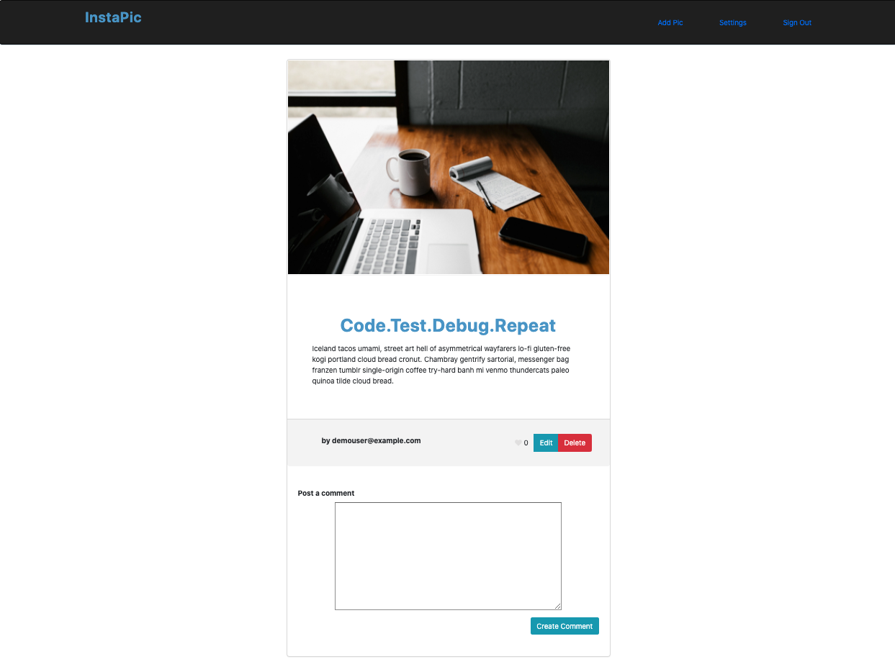
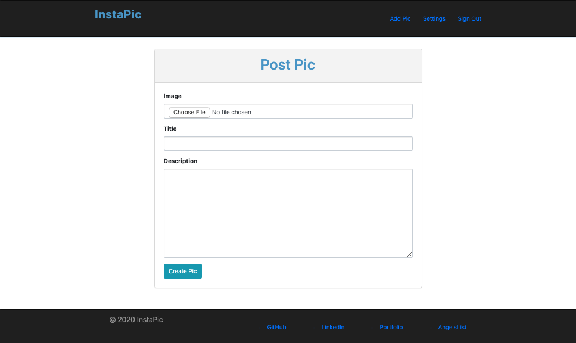

## Background and Overview
[
InstaPic](https://instapic00.herokuapp.com/) an app inspired by Instagram where users can upload, edit, like, and leave comments on pictures. It allows for user authentication and login, display of all pictures uploaded by users, and interaction with other users through likes and comments. Pictures are uploaded to an AWS S3 bucket via Active Storage.

## Functionality
- Upload pictures if logged in.
- Edit/delete their own pictures. 
- Like or unlike pictures.
- Comment on pictures and delete their own comments.
- Access their profile page which displays picture the user has posted as well as liked 

# Technologies & Technical Challenges

## Architecture
Instapic is built with the Ruby on Rails, Bootstrap, Paperclip & AWS S3 for image handling.

### Dependencies	
- Bootstrap-Sass 
- AWS S3
- Devise
- Simple Form

## Picture Show Page
Upon clicking on a picture, the user will be directed to that pictures's show page. There, the picture will be displayed on an enlarged scale. The picture is able to be liked/unliked and commented upon. 


<!--  -->

Posting a comment required a user to be signed in. Deleting a comment is restricted to only the user it belongs to.
```
#comments.row
.col-md-12
  %br
  - @pic.comments.each do |comment|
    %div.pb-5
      %p #{content_tag(:strong, "#{comment.user.username}")} #{comment.body}
      %small.comment_time= "#{time_ago_in_words(comment.created_at)} ago" 
      - if user_signed_in? && current_user.id == comment.user_id
        = link_to 'Delete', [comment.pic, comment], method: :delete, data: { confirm: "Delete Comment?" }
  %br
  
- if user_signed_in?
  = render 'comments/form'
```

## Picture Upload
Users also have the ability to upload their own pictures if logged in. Uploaded pictures will be added to the entire index of pictures and render on the main page. 


<!--  -->

Uploading pictures is handled using paperclip:
models/pic.rb
```
has_attached_file :image, :styles => { medium: "300x300>", thumb: "100x100>" }
validates_attachment_content_type :image, :content_type => /\Aimage\/.*\Z/
```
views/pics/show.html.haml
```
.panel.heading.pic_image
  = image_tag @pic.image.url
.panel-body
  %h1= @pic.title
  %p= @pic.description
```

## User Profile
The user profile is accessible through the navigation bar. The user can view the number of pictures he/she has posted as well as the pictures that they've liked.


## Future directions
- [x] User Profile
- [x] Like/Unlike Comments
- [ ] Follow Other Users
- [ ] Search
